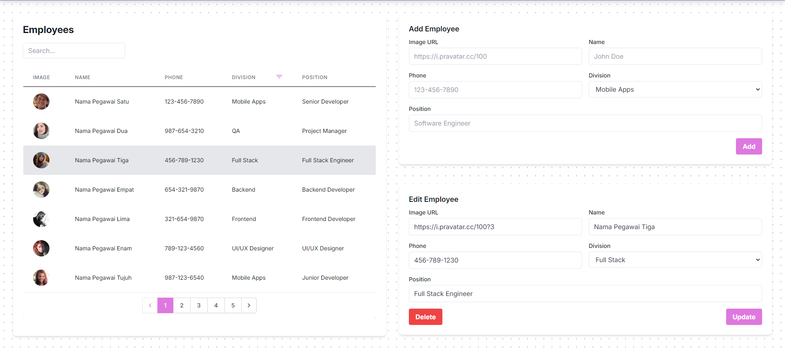
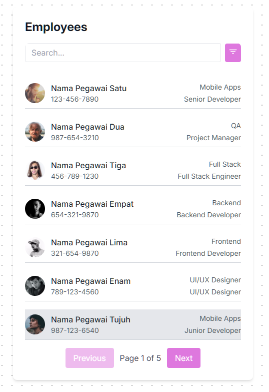

# Aplikasi CRUD dengan Vue 3 dan Tailwind CSS

Proyek ini merupakan aplikasi CRUD (Create, Read, Update, Delete) sederhana yang dibangun menggunakan Vue 3 dan Tailwind CSS. Aplikasi ini mendemonstrasikan implementasi fitur-fitur yang diminta dalam tes magang Frontend Developer di PT Aksamedia Mulia Digital.

## Fitur-Fitur

### 1. Autentikasi (Login/Logout)

-   **Login Tanpa API:** Aplikasi ini mengimplementasikan sistem login sederhana tanpa memerlukan API eksternal. Otentikasi dilakukan secara lokal.
-   **Tanpa Registrasi:** Fitur registrasi tidak diimplementasikan sesuai dengan persyaratan.
-   **Nama Pengguna di Navbar:** Setelah login berhasil, nama pengguna (atau username jika nama lengkap tidak tersedia) ditampilkan di pojok kanan atas navbar.
-   **Logout:** Tombol logout tersedia di dalam dropdown menu di pojok kanan atas navbar.
-   **Persistensi Sesi:** Status login pengguna dipertahankan meskipun halaman direfresh, hingga pengguna melakukan logout secara manual. Ini dicapai dengan menyimpan informasi pengguna di `localStorage`.
-   **Dropdown Tanpa Library:** Dropdown menu dibuat secara manual menggunakan komponen Vue dan Tailwind CSS tanpa library pihak ketiga.

### 2. CRUD Tanpa API

-   **CRUD Lokal:** Operasi CRUD (Create, Read, Update, Delete) dilakukan secara lokal menggunakan `localStorage` untuk menyimpan data.
-   **Search, Filter, dan Paginasi:**
    -   **Search:** Terdapat fitur pencarian yang memungkinkan pengguna untuk mencari data karyawan berdasarkan nama.
    -   **Filter:** Pengguna dapat memfilter data karyawan berdasarkan divisi.
    -   **Paginasi:** Data karyawan ditampilkan dalam bentuk tabel (untuk desktop) dan stacked list (untuk tablet dan mobile) dengan paginasi. Paginasi diimplementasikan tanpa library pihak ketiga.
-   **Persistensi State Halaman CRUD:** State halaman CRUD (seperti halaman saat ini, query pencarian, dan filter yang diterapkan) dipertahankan meskipun halaman direfresh. State ini disimpan di `localStorage` dan di URL sebagai query string.

### 3. Halaman

-   **Halaman Login (`/login`):** Halaman ini menampilkan formulir login dan hanya dapat diakses jika pengguna belum login.
-   **Halaman CRUD (`/`):** Halaman ini menampilkan daftar karyawan dan memungkinkan pengguna untuk melakukan operasi CRUD. Halaman ini hanya dapat diakses jika pengguna sudah login.
-   **Halaman Pengaturan (`/settings`):** Halaman ini memungkinkan pengguna untuk mengubah nama lengkap dan tema aplikasi. Hanya dapat diakses jika pengguna sudah login.

### 4. Keamanan

-   **Proteksi Halaman:** Semua halaman kecuali halaman login tidak dapat diakses jika pengguna belum login. Jika pengguna belum login dan mencoba mengakses halaman-halaman tersebut, mereka akan diarahkan ke halaman login.

### 5. Tema (Dark Mode/Light Mode)

-   **Tiga Pilihan Tema:** Aplikasi mendukung tiga pilihan tema:
    -   `dark`: Mode gelap.
    -   `light`: Mode terang.
    -   `system`: Mengikuti pengaturan tema sistem operasi.
-   **Tema Default:** Tema default diatur untuk mengikuti pengaturan sistem operasi.
-   **Sinkronisasi dengan OS:** Jika tema sistem operasi diubah, tema aplikasi akan otomatis menyesuaikan.
-   **Persistensi Tema:** Tema yang dipilih pengguna disimpan di `localStorage` dan akan tetap digunakan meskipun halaman direfresh.

### 6. Edit Profil

-   **Edit Nama Lengkap:** Pengguna dapat mengubah nama lengkap mereka di halaman pengaturan.
-   **Update Navbar:** Perubahan nama lengkap akan langsung tercermin di navbar.
-   **Persistensi Data:** Perubahan data pengguna disimpan di `localStorage` dan akan tetap ada meskipun halaman direfresh.

### 7. Responsivitas

-   **Desain Responsif:** Aplikasi ini dirancang untuk tampil dengan baik di berbagai ukuran layar, termasuk desktop, tablet, dan mobile.
-   **Tailwind CSS:** Responsivitas dicapai dengan menggunakan utility classes dari Tailwind CSS.

### 8. Teknologi

-   **Vue 3:** Aplikasi ini dibangun menggunakan framework JavaScript Vue 3.
-   **Tailwind CSS:** Styling aplikasi menggunakan utility-first CSS framework Tailwind CSS.
-   **`localStorage`:** Digunakan untuk menyimpan data karyawan, state aplikasi, informasi pengguna, dan preferensi tema.
-   **Vue Router:** Digunakan untuk routing antar halaman.

## Cara Menjalankan Aplikasi

1. Pastikan Anda memiliki Node.js dan npm (atau yarn) terinstal di komputer Anda.
2. Clone repositori ini:
    ```bash
    git clone <repository-url>
    ```
3. Masuk ke direktori proyek:
    ```bash
    cd <project-directory>
    ```
4. Install dependencies:
    ```bash
    npm install
    ```
    atau
    ```bash
    yarn install
    ```
5. Jalankan aplikasi:
    ```bash
    npm run dev
    ```
    atau
    ```bash
    yarn dev
    ```
6. Buka browser dan kunjungi `http://localhost:5173/` (atau port lain yang ditentukan oleh Vite).

## Design Choices

Dalam pengembangan aplikasi CRUD ini, beberapa keputusan desain (design choices) diambil untuk memastikan tampilan yang menarik, fungsionalitas yang baik, dan pengalaman pengguna yang optimal di berbagai perangkat. Berikut adalah pembahasan beberapa design choices utama:

### 1. Bento Box Design untuk Halaman Index CRUD (Desktop)

**Screenshot:**



**Alasan:**

-   **Efisiensi Ruang:** Pada tampilan desktop, terdapat ruang layar yang cukup luas. Bento box design dipilih karena memungkinkan penyajian informasi yang terstruktur dan efisien dalam satu tampilan.
-   **Kejelasan Informasi:** Dengan membagi halaman menjadi dua bagian utama (daftar karyawan di sebelah kiri dan form di sebelah kanan), pengguna dapat dengan mudah melihat daftar karyawan sekaligus melakukan operasi CRUD (Create, Update, Delete) tanpa perlu berpindah halaman atau scroll terlalu banyak.
-   **Visual yang Menarik:** Bento box design memberikan kesan visual yang rapi, modern, dan terorganisir, yang dapat meningkatkan estetika aplikasi.
-   **Fokus yang Jelas:** Pemisahan yang jelas antara daftar karyawan dan formulir membantu pengguna untuk fokus pada tugas yang sedang mereka lakukan.

**Implementasi:**

-   Layar dibagi menjadi dua kolom dengan lebar yang sama (`w-1/2`) menggunakan Tailwind CSS.
-   Kolom kiri berisi `DataTable` untuk menampilkan daftar karyawan.
-   Kolom kanan dibagi lagi menjadi dua bagian untuk `CreateForm` dan `UpdateDeleteForm`, sehingga pengguna dapat dengan mudah menambah atau mengedit data karyawan.

### 2. Stacked List untuk Tablet dan Mobile

**Screenshot:**



**Alasan:**

-   **Responsivitas:** Pada layar tablet dan mobile, ruang layar terbatas. Penggunaan `DataTable` yang lebar tidak akan optimal. Stacked list dipilih karena dapat menampilkan informasi secara vertikal dan ringkas, sehingga cocok untuk layar yang lebih kecil.
-   **Kemudahan Navigasi:** Pengguna dapat dengan mudah menelusuri daftar karyawan dengan melakukan scroll secara vertikal.
-   **Informasi yang Tetap Jelas:** Meskipun ringkas, stacked list tetap dapat menampilkan informasi penting setiap karyawan, seperti foto, nama, nomor telepon, divisi, dan posisi.
-   **Touch-Friendly:** Desain stacked list lebih mudah dioperasikan pada perangkat layar sentuh, karena area sentuh untuk setiap item cukup besar.

**Implementasi:**

-   Komponen `StackedList` digunakan untuk menampilkan daftar karyawan dalam format stacked list.
-   Komponen `EmployeeItem` digunakan untuk merender setiap item dalam stacked list.
-   Pada tampilan tablet:
    -   Layar dibagi menjadi dua kolom, dengan kolom kiri berisi `StackedList` dan kolom kanan berisi `CreateForm` dan `UpdateDeleteForm`.
-   Pada tampilan mobile:
    -   `CreateForm`, `StackedList`, dan `UpdateDeleteForm` ditampilkan secara berurutan dalam satu kolom, memungkinkan pengguna untuk fokus pada satu tugas dalam satu waktu.
-   Deteksi ukuran layar menggunakan `window.innerWidth` dan `ref` reaktif dari Vue untuk menentukan apakah tampilan mobile, tablet, atau desktop yang harus digunakan.

### 3. Penggunaan Warna dan Tema

-   **Konsistensi:** Skema warna yang konsisten digunakan di seluruh aplikasi untuk menciptakan identitas visual yang kuat.
-   **Kontras:** Pemilihan warna yang kontras antara latar belakang, teks, dan elemen interaktif memastikan keterbacaan yang baik dan aksesibilitas yang lebih baik.
-   **Dark Mode/Light Mode:** Implementasi dark mode dan light mode memberikan fleksibilitas kepada pengguna untuk memilih tampilan yang sesuai dengan preferensi atau kondisi pencahayaan.
-   **Tema Sistem:** Opsi untuk mengikuti tema sistem operasi meningkatkan integrasi aplikasi dengan perangkat pengguna.

### 4. Tipografi

-   **Font Inter:** Font Inter digunakan karena keterbacaannya yang baik di berbagai ukuran layar dan kesan modern yang ditimbulkannya.
-   **Hierarki Visual:** Penggunaan ukuran font yang berbeda untuk judul, subjudul, dan teks isi membantu menciptakan hierarki visual yang jelas dan memandu pengguna dalam membaca informasi.

### 5. Komponen Reusable

-   **Modularitas:** Aplikasi ini menggunakan komponen-komponen reusable seperti `TextInput`, `PasswordInput`, `Dropdown`, `DropdownItem`, `DataTable`, dan `StackedList`.
-   **Maintainability:** Penggunaan komponen reusable membuat kode lebih mudah dikelola, dimodifikasi, dan diperluas di masa mendatang.
-   **Konsistensi:** Penggunaan komponen yang sama di seluruh aplikasi memastikan konsistensi tampilan dan fungsionalitas.